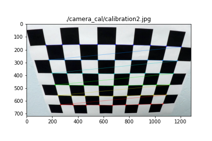
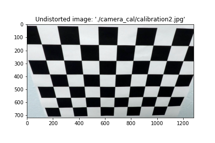
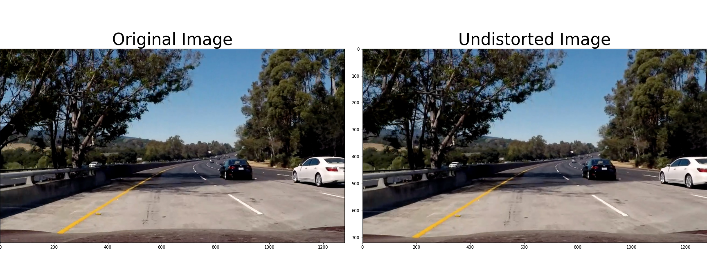
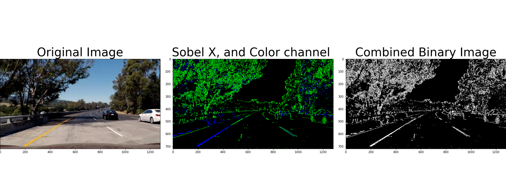
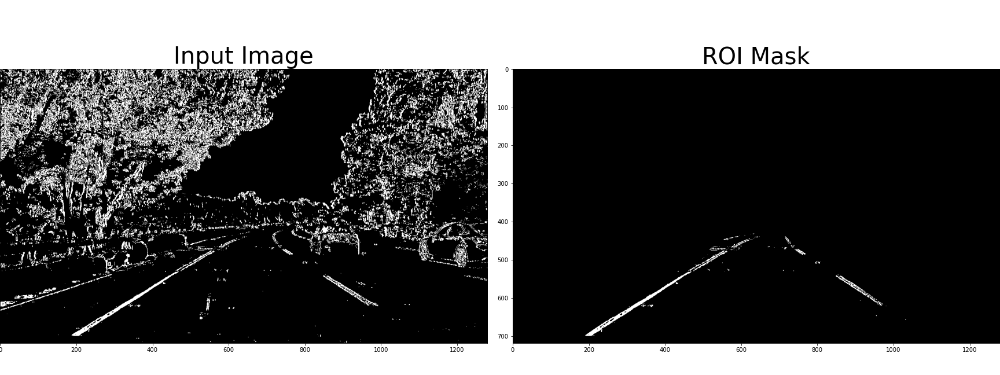
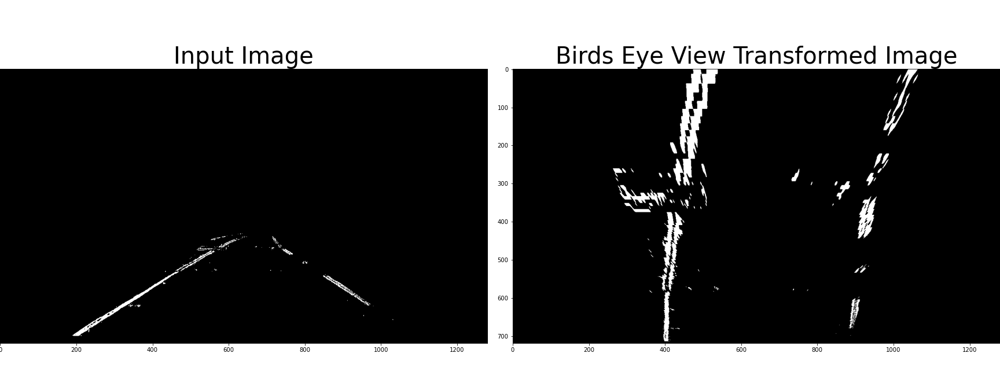
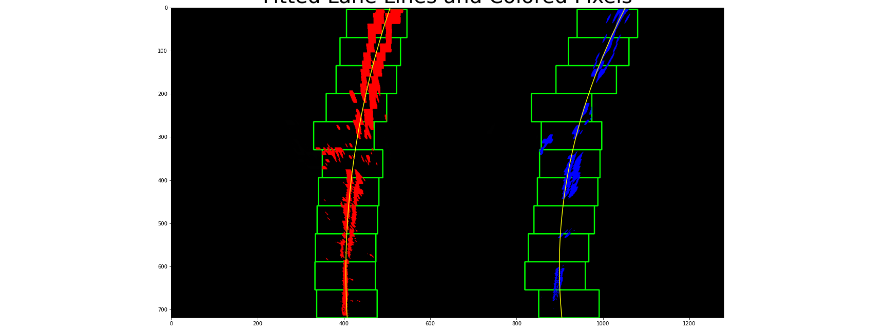
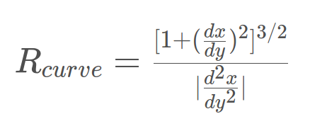
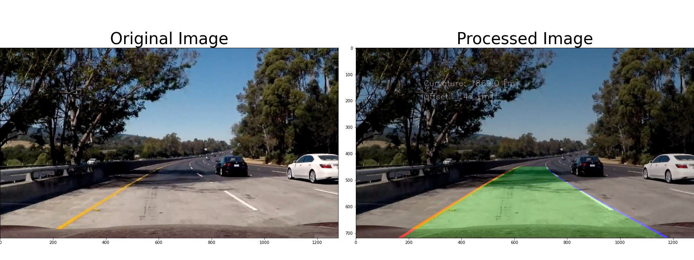

# **Finding Lane Lines on the Road** 

---

## Goals
* Make a pipeline that reliably (90%) draws lane lines on the road

[//]: # (Image References)

[image1]: ./examples/grayscale.jpg "Grayscale"

---

## Reflection

### 1. Camera Calibration
Modern cameras use a lense that causes distortion around the edges of the image. This can be undistorted with some math and images of a well known object, in this case, a chessboard 

- Find object points by creating a grid to overlay the chessboard
- Find image points by detecting the internal corners of the chessboard using `cv2.findChessboardCorners()` 

- Calibrate the camera using the object and image points with `cv2.calibrateCamera()` 

### 2. Pipeline
1. Undistort image 

2. Create a binary image using color transforms and gradient thresholds using `createBinary()` 
    - Convert the image to HLS color space, then find where the image has the greatest change (gradient) in lightness 
    - Perform a Sobel derivative in the X direction
    - Combine the two into a binary mask 

3. Region of interest masking 

4. Perspective tranform to get a birds eye view of the image `birdsEyeView()`
    - Designate source (original image) points using the region of interest vertices
    - Designate destination (transformed image) points using the farthest corners of the image 
    - Calculate the perspective transform matrix with `cv2.getPerspectiveTransform(srcPts, dstPts)`
    - Perform the transform with `cv2.warpPerspective()` using linear interpolation 

5. Fit a polynomial to the identified lane pixels `fit_polynomial()` 
    - Find the lane pixels first with the moving window method and then with a look ahead method where you search in the vicinity of the last found line `find_lane_pixels()` and `search_around_poly()`
    - Fit the pixels with a second order polynomial 

6. Calculate line characteristics `measure_lines_in_meters()` 
    - Find a conversion from pixels to meters, ideally this would be automatic, but here it is hardcoded from a test image as the dimensions of the lane 
    - Find the base of the lane nearest the bottom of the image relative to the center of the car (image) using the pixel conversion stated above
    - Calculate the radius of curvature using 

7. Draw the final lane lines on original image `drawInfoOnRoad()` 

### 3. The Guided Video
<video width="320" height="240" controls>
  <source src="./output_images/test1.mp4" type="video/mp4">
</video>

### 4. Improvements
- Keep track of recent measures of curvature so the lane can be corrected if a few stray pixels pull the lane the wrong direction
- Increase the sanity check to find only the vertical lines that start somewhere on the path of the last. This will not solve the challenge of not picking up vertical lines on the road but it will help
- Use a Sobel gradient in the Y direction to identify vertical lines wide enough to be lane lines
- Overall better tuning, filtering, and sanity checks/stored data
